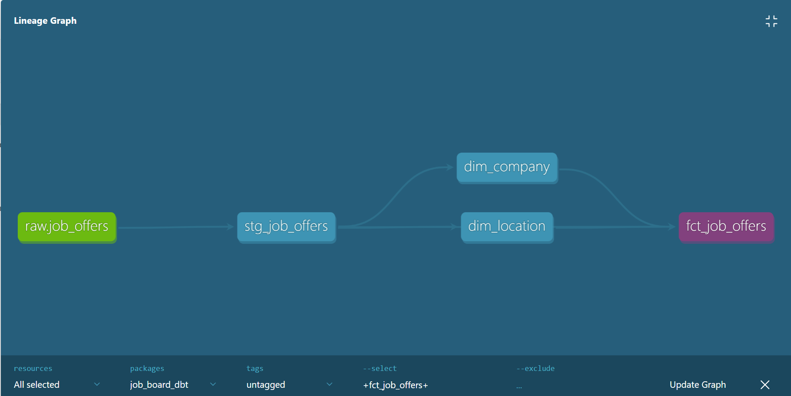
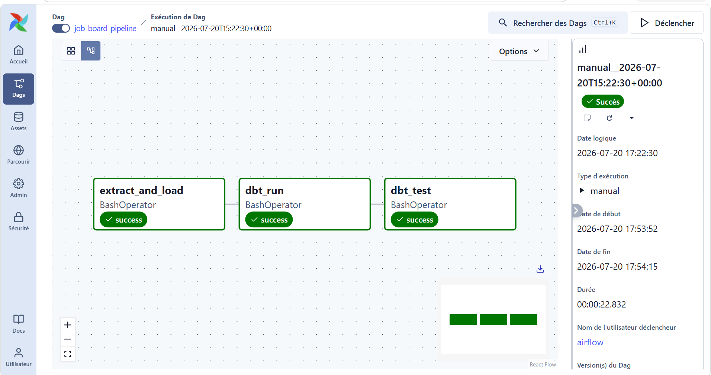

# Job Board Data Pipeline — dbt + Snowflake + Airflow

Pipeline de données permettant de centraliser les offres d'emploi d'un job board dans un data warehouse Snowflake, de les transformer via dbt selon une modélisation en étoile, puis (à venir) d'automatiser l'ensemble avec Airflow.

## Objectif du projet

Ce projet a été construit dans un but d'apprentissage et de démonstration de compétences en **analytics engineering** : extraction de données, chargement dans un data warehouse cloud, transformation avec dbt, tests de qualité de données, documentation, et orchestration.

## Architecture

```
Adzuna API  -->  Script Python  -->  Snowflake (RAW)  -->  dbt (TRANSFORM)  -->  Airflow (orchestration)
```

- **Extraction** : un script Python interroge l'API Adzuna (offres d'emploi) avec pagination, et charge les résultats bruts (JSON) dans Snowflake.
- **Chargement** : les données brutes sont stockées telles quelles dans une table `VARIANT`, pattern ELT classique — aucune transformation n'est faite côté Python.
- **Transformation (dbt)** : les données brutes sont nettoyées, typées, puis modélisées en schéma en étoile.
- **Orchestration (Airflow)** : *(à venir)* automatisation de l'extraction et des runs dbt.

## Modélisation des données

Le projet suit une modélisation en couches, standard en analytics engineering :

| Couche | Modèle | Rôle |
|---|---|---|
| Source | `raw.job_offers` | Données brutes (JSON) chargées depuis l'API Adzuna |
| Staging | `stg_job_offers` | Parsing du JSON, typage des colonnes, une ligne par offre |
| Dimension | `dim_company` | Entreprises uniques, avec clé de substitution (`company_id`) |
| Dimension | `dim_location` | Localisations uniques, avec clé de substitution (`location_id`) |
| Fait | `fct_job_offers` | Une ligne par offre, enrichie des clés étrangères vers les dimensions, avec salaire moyen calculé |

## Data Lineage



Isoler les entreprises et localisations dans des tables de dimension évite la redondance de texte à chaque ligne d'offre, et permet des jointures propres et réutilisables. La table de faits `fct_job_offers` centralise les métriques (salaires) et les clés étrangères, dans la logique d'un schéma en étoile classique.

## Qualité des données

Des tests dbt sont appliqués sur les modèles clés :
- `unique` et `not_null` sur les identifiants (`job_id`, `company_id`, `location_id`)
- `dbt_utils.accepted_range` sur les salaires, pour détecter des valeurs aberrantes (négatives)

## Orchestration Airflow

Le pipeline est automatisé via un DAG Airflow, exécuté quotidiennement (schedule="@daily"), avec trois tâches enchaînées :

extract_and_load  >>  dbt_run  >>  dbt_test
extract_and_load : exécute le script d'extraction Adzuna et charge les données brutes dans Snowflake
dbt_run : construit l'ensemble des modèles dbt (staging + marts)
dbt_test : valide la qualité des données




**Environnement d'exécution :** Airflow tourne dans des conteneurs Docker (webserver, scheduler, base de données), avec une image personnalisée qui étend l'image officielle apache/airflow pour y installer les dépendances du projet (dbt-core, dbt-snowflake, snowflake-connector-python...). Les dossiers extraction/ et job_board_dbt/, ainsi que le fichier .env, sont montés en volumes pour que les conteneurs y aient accès.

## Stack technique
Extraction : Python (requests, snowflake-connector-python, python-dotenv)
Data Warehouse : Snowflake
Transformation : dbt (dbt-core + dbt-snowflake)
Tests de données : dbt natif + package dbt_utils
Orchestration : Apache Airflow (Docker Compose)

## Structure du projet

```
job-board-pipeline/
├── dags/
│   └── job_board_pipeline_dag.py  # DAG Airflow : extraction -> dbt run -> dbt test
├── extraction/
│   └── adzuna_extractor.py        # extraction API Adzuna + chargement Snowflake RAW
├── job_board_dbt/
│   ├── models/
│   │   ├── staging/
│   │   │   ├── sources.yml
│   │   │   └── stg_job_offers.sql
│   │   └── marts/
│   │       ├── dim_company.sql
│   │       ├── dim_location.sql
│   │       ├── fct_job_offers.sql
│   │       └── schema.yml         # tests dbt
│   ├── dbt_project.yml
│   ├── packages.yml
│   └── profiles.yml               # connexion Snowflake via variables d'environnement
├── docs/
│   ├── lineage.png
│   └── airflow_dag_success.png
├── docker-compose.yaml
├── Dockerfile                     # étend l'image Airflow officielle avec requirements.txt
├── requirements.txt
└── .gitignore
```

## Installation et exécution en local

**1. Prérequis**
Python 3.10+
Docker Desktop
Un compte Snowflake actif
Une clé API Adzuna (gratuite sur developer.adzuna.com)

**2. Installation (extraction + dbt en local, hors Airflow)**
bash
python -m venv venv
.\venv\Scripts\Activate.ps1   # Windows
pip install -r requirements.txt

**3. Variables d'environnement**

Créer un fichier .env à la racine du projet (non versionné) :

ADZUNA_APP_ID=xxxx
ADZUNA_APP_KEY=xxxx
SNOWFLAKE_ACCOUNT=xxxx
SNOWFLAKE_USER=xxxx
SNOWFLAKE_PASSWORD=xxxx
SNOWFLAKE_ROLE=xxxx
AIRFLOW_UID=50000

**4. Structure Snowflake**

Créer la base, le warehouse et la table brute :

sql
CREATE DATABASE IF NOT EXISTS JOB_BOARD_DB;
CREATE WAREHOUSE IF NOT EXISTS JOB_BOARD_WH
  WAREHOUSE_SIZE = 'XSMALL'
  AUTO_SUSPEND = 60
  AUTO_RESUME = TRUE;

CREATE SCHEMA IF NOT EXISTS JOB_BOARD_DB.RAW;

CREATE TABLE IF NOT EXISTS JOB_BOARD_DB.RAW.JOB_OFFERS (
    raw_data VARIANT,
    loaded_at TIMESTAMP_NTZ DEFAULT CURRENT_TIMESTAMP()
);

**5. Exécution manuelle (sans Airflow)**
python extraction/adzuna_extractor.py

dbt deps --project-dir job_board_dbt --profiles-dir job_board_dbt
dbt run --project-dir job_board_dbt --profiles-dir job_board_dbt
dbt test --project-dir job_board_dbt --profiles-dir job_board_dbt
dbt docs generate --project-dir job_board_dbt --profiles-dir job_board_dbt
dbt docs serve --project-dir job_board_dbt --profiles-dir job_board_dbt

**6. Exécution automatisée via Airflow**
docker compose up --build